<h1 align="center">Hey, I'm Koragan</h1>

<p align="center">
  AI &amp; automation enthusiast — I build small tools mostly for the fun of learning how things work.
</p>

<p align="center">
  <a href="mailto:amirkoragan@gmail.com"></a>
</p>

---

<p align="center">
  
</p>

---

### Stats

### Stats

```text
       .                .                    
       :"-.          .-";                    
       |:`.`.__..__.'.';|                    
       || :-"      "-; ||                    
       :;              :;                    
       /  .==.    .==.  \                    
      :      _.--._      ;                   
      ; .--.' `--' `.--. :                   
     :   __;`      ':__   ;                  
     ;  '  '-._:;_.-'  '  :           notting here yet       
     '.       `--'       .'                  
      ."-._          _.-".                   
    .'     ""------""     `.                 
   /`-                    -'\                
  /`-                      -'\               
 :`-   .'              `.   -';              
 ;    /                  \    :              
:    :                    ;    ;             
;    ;                    :    :             
':_:.'                    '.;_;'             
   :_                      _;                
   ; "-._                -" :`-.     _.._    
   :_          ()          _;   "--::__. `.  
    \"-                  -"/`._           :  
   .-"-.                 -"-.  ""--..____.'  
  /         .__  __.         \               
 : / ,       / "" \       . \ ; bug          
  "-:___..--"      "--..___;-"

---

<p align="center"><i>Thanks for stopping by</i></p>
